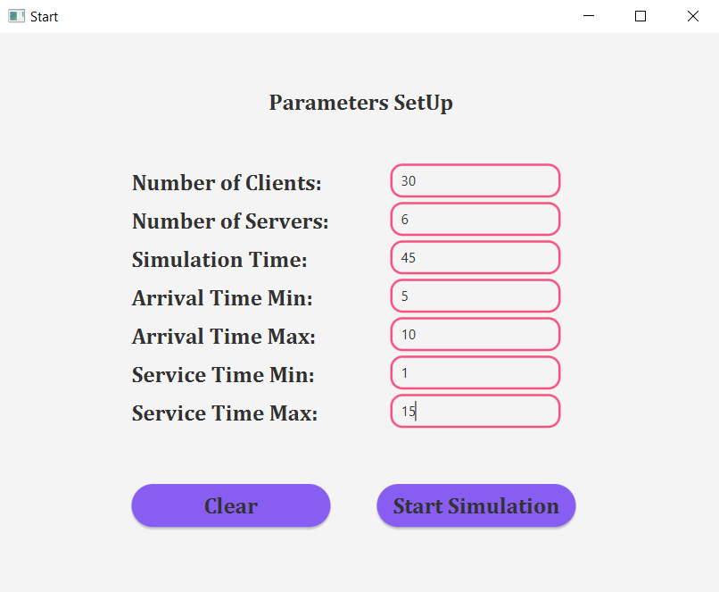
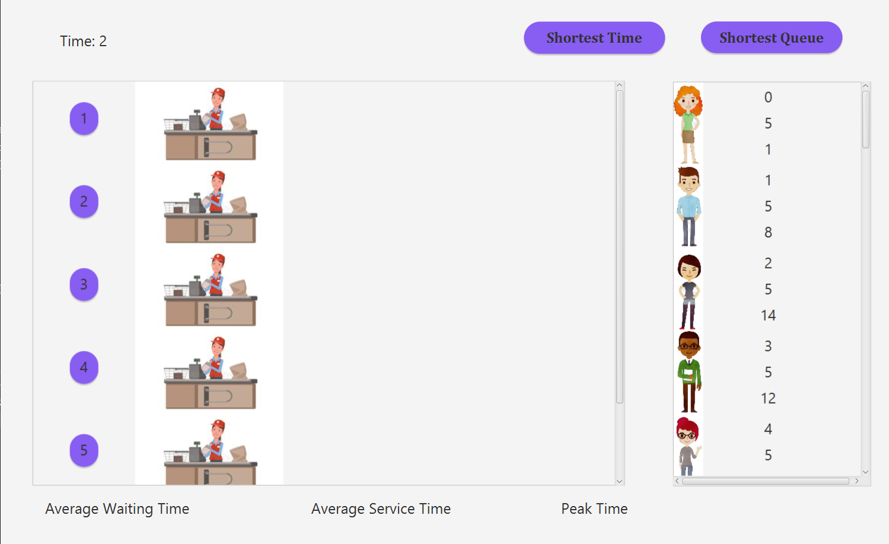
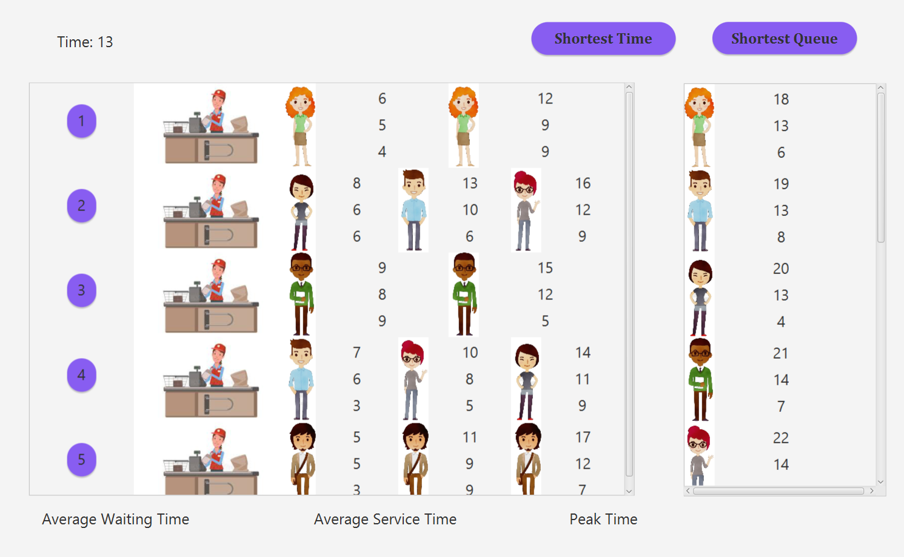
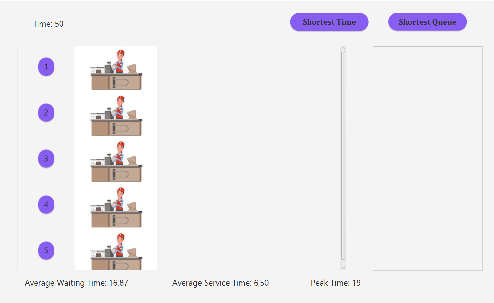

# Queue Management Simulation Application

Welcome to our Queue Management Simulation Application! This application serves as a powerful tool for analyzing queuing systems, facilitating the evaluation of client arrivals, queue management, service provision, and departure processes. Below, you'll find detailed information on the objectives, requirements, design, implementation, and conclusions of our application.

---

## Objectives:

The primary objective of our Queue Management Simulation Application is to develop a comprehensive tool for simulating queuing-based systems. The sub-objectives include:

1. **Problem Analysis and Requirement Identification**: Analyzing queuing system dynamics to identify necessary functionalities and constraints.
2. **Application Design**: Designing a robust architecture, user interface, data flow, and algorithms for accurate simulation.
3. **Application Implementation**: Translating the design into a functional application incorporating client generation, queue management, service allocation, time tracking, and data analysis.
4. **Application Testing**: Rigorously testing the application to ensure accuracy, reliability, and scalability under various scenarios.

### Problem Analysis, Modeling, Scenarios, Use Cases:

#### Functional Requirements:

- **Simulation Setup**: Allowing users to configure simulation parameters such as the number of clients, service durations, and queue capacities.
- **Simulation Initiation**: Enabling users to commence the simulation seamlessly, triggering the simulation engine to execute predefined scenarios.
- **Real-time Queue Visualization**: Providing a graphical representation of queue statuses in real-time for efficient monitoring.
- **Simulation Statistics**: Offering comprehensive statistics and metrics summarizing the simulation's performance.

#### Non-functional Requirements:

- **Intuitive User Interface**: Designing a user-friendly interface with clear navigation and controls.
- **Robust Error Handling**: Incorporating mechanisms for detecting and handling errors during setup or execution.
- **Performance and Scalability**: Ensuring high performance and scalability, even with large numbers of clients and servers.

Pictures:

